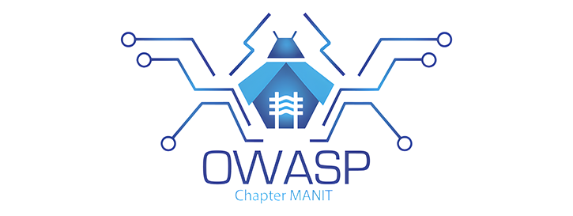

---

layout: col-sidebar  
title: OWASP Chapter MANIT  
tags: MANIT OWASP Chapter India  
level: 6  
meetup-group: MANIT-OWASP-Meetup-Group  
country: India  
region: Asia  

---

## Welcome  

  

Welcome to the **OWASP Chapter of MANIT, Bhopal**! We're excited to announce the launch of our new chapter, focused on improving awareness and knowledge of software and cyber security among students.  

Founded by passionate cybersecurity advocates, this chapter serves as a platform for students and enthusiasts to dive deep into the world of application security, ethical hacking, and secure software development practices.  

At OWASP Chapter MANIT, we believe in building from the ground up — starting with the fundamentals of cybersecurity and progressing to cutting-edge techniques. We conduct regular workshops, seminars, hands-on sessions, and Capture The Flag (CTF) competitions that challenge and grow participants' technical abilities.  

We are **actively seeking volunteers and contributors** to help us run and expand our events. If you're passionate about cybersecurity and want to make a difference, get in touch with any of the chapter leaders — we'd love to have you on board!  

Together, let's build a stronger, safer, and more secure digital world starting right here at MANIT.

**Founders:**  
- [Gautam Pratap](https://www.linkedin.com/in/gautampratap/)  
- [Durgesh Shah](https://www.linkedin.com/in/darkoid/)  

## Upcoming Events  

- **Security Awareness Drive**: Conducted sessions on basic digital hygiene and cyber threats in local Bhopal colleges including IES College.  
- **Safer Internet Day**: Celebrated with a day-long event in MANIT Bhopal including expert talks and awareness campaigns.  
- **CyberQuest**: (Annual Cybersecurity Conclave by OWASP CHAPTER MANIT)
  - **CyberHunter**: A real-world hacking simulation game that tested critical thinking, reconnaissance, and vulnerability exploitation.  
  - **CyberBasics**: A beginner-friendly guest lecture and workshop on core cybersecurity principles and tools.  
  - **OWASP MANIT CTF**: A competitive Capture The Flag contest open to all colleges in Bhopal.  

Stay tuned to our Meetup page and social media for updates on upcoming talks, training sessions, and community collaborations.


## Past Events

**OWASP MANIT CTF** - Capture the Flag Competition - 2025, April 13th
- [Event Details](https://www.instagram.com/p/DH2vh8GzCfj/?igsh=cmtjcmZqZXJqNmQz)
- [Registration Details](https://unstop.com/o/VRJwKBz?utm_medium=Share&utm_source=shortUrlz)

**CyberBasics 1.0** - Beginner Guest Lecture - 2025, April 12th
- [Event Details](https://www.instagram.com/p/DIHgcohztwi/?igsh=MXRxMGl3a2VrbTN1aQ==)

**CyberHunter 1.0** - Real World Hacking Game - 2025, April 11th to 13th
- [Event Details](https://www.instagram.com/p/DIFCDT5sz7t/?igsh=MnFobWl6eHoydGc4)

**CyberQuest 1.0** - The Cybersecurity Conclave of NIT Bhopal - 2025, April 11th to 13th
- [Event Details](https://www.instagram.com/p/DIKGalRzg2r/?igsh=MTZjZ2dybHUzNTU2aQ==)

**Safer Internet Day** - 2025, February 11th 
- [Event Details](https://www.instagram.com/p/DF8MCdBz5Bt/?igsh=NnQxd3VmajQxeW1n)

**Stay Safe on Social Media** - 2023, September 18th 
- [Event Details](https://www.instagram.com/p/CxTxmaYKRyU/?igsh=bnVpZnRuMDVtcHpw)


## **OWASP CHAPTER MANIT TEAM (2024-2025)**

**Final Year**
 - Gautam Pratap (Coordinator / Chapter Leader / Founder)
 - Arpit Goyal (Co-coordiantor)
 - Pavit Chabbra (Co-coordiantor)

**Third Year**
 - Ranjeet Singh

**Second Year**
 - Pulkit Gangil
 - Pradeep Yadav
 - Swati Menon
 - Abizer
 - Paridhi
 - Shubhi

**First Year**
 - Ashish 
 - Aaditya 
 - Tanishq 
 - Vijay 
 - Vishal 
 - Shivansh
 - Raghav
 - Mudit
 - Khushboo
 - Kavya
 - Sanjna
 - Sanjita
 - Prabhat
 - Pranjali
 - Ashu


## **OWASP CHAPTER MANIT TEAM (2023-2024)**

**Final Year**
 - Durgesh Shah (Coordinator / Chapter Leader / Founder)

**Third Year**
 - Gautam Pratap (Founder)
 - Arpit Goyal
 - Pavit Chabbra

**Second Year**
 - Ranjeet Singh


## Previous Chapter Leaders

Durgesh Shah (June 2023 - July 2024)


## OWASP CHAPTER MANIT FOUNDERS

### Gautam Pratap
 - Aspiring Electrical Engineer, Certified Ethical Hacker, Certified Network Security Practitioner
 - Introduced CyberQuest - The Cybersecurity Conclave of NIT Bhopal
* [LinkedIn](https://www.linkedin.com/in/gautampratap/)

### Durgesh Shah
 - Security Engg @ JCI · eWPTX · eJPTv2
* [LinkedIn](https://www.linkedin.com/in/darkoid/)

## Speakers
Would you like to speak on the upcoming OWASP Chapter MANIT, Bhopal meetup? [Contact Us](mailto:owasp.chap.manit@gmail.com)

**Email Format :**

- Speaker name
- Job Role
- Company / Organization
- Country
- Email ID
- Contact Number
- Speaker Profile
- Presentation Details
    - Name / Title of the Presentation
    - Abstract of the presentation
    - Presentation time required


## Participation  

The Open Worldwide Application Security Project (OWASP) is a nonprofit foundation that works to improve the security of software. All of our tools, documents, projects, and chapters are open-source and free to everyone.  

To be a **speaker** at OWASP Chapter MANIT (or any global chapter), simply reach out to the local chapter leaders with your topic, research, or workshop idea — we are always looking for fresh voices and knowledge to share!  

Everyone is welcome to be part of our community — from beginners to experts. Whether you're here to learn, contribute, or lead, OWASP is the place for you. We especially encourage diversity and collaboration.  

Join us through:  
- [Projects](/projects)  
- [Chapters](/chapters)  
- [Events](/events)  
- [OWASP Google Groups](https://groups.google.com/a/owasp.com/)  
- [OWASP Slack](https://owasp.slack.com/)  

You can also [become a member](/membership) or [donate](/donate) to support our mission.  

```Switch to Speakers tab for more information on presenting your research or talk at OWASP Chapter MANIT```  

## Upcoming Meetup Events  

  

Follow us on Twitter and LinkedIn for the latest news and updates.
